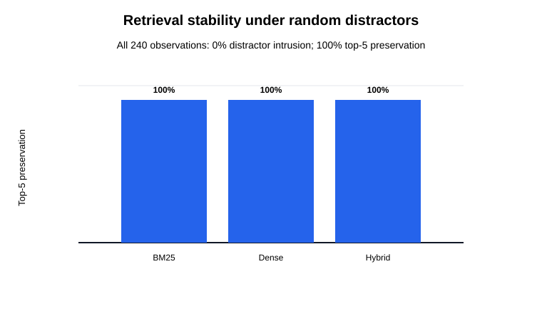
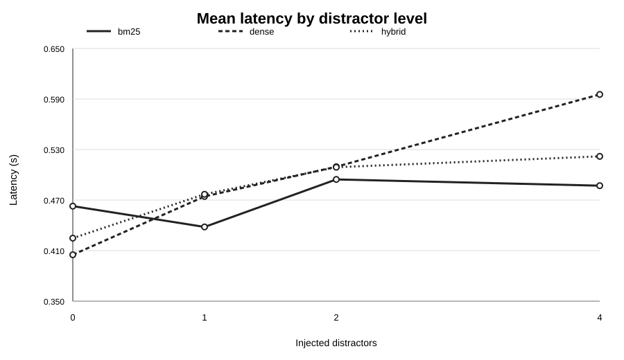
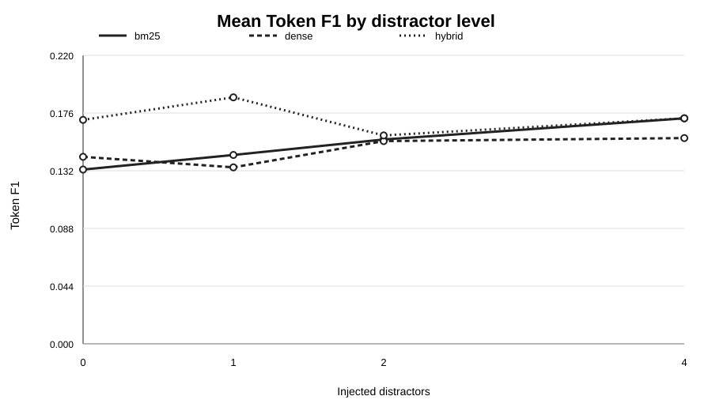
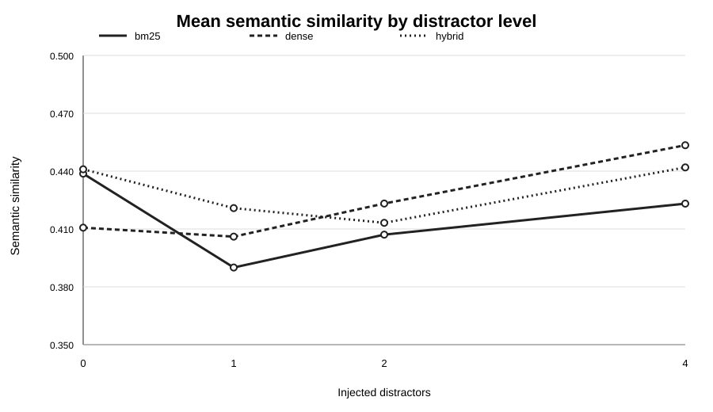

# Effects of Appended Distractor Context on RAG Answer Quality and Generation Latency

**Author:** Shaik Jouzia Afreen H  
**Research area:** Retrieval-Augmented Generation (RAG), information retrieval, natural language processing  
**Study type:** Controlled computational evaluation  
**Version:** Manuscript v1.2 (artifact-reconciled draft; not yet submission-ready)

## Abstract

Retrieval-Augmented Generation (RAG) systems depend on retrieval to supply evidence to downstream language generation. Irrelevant text appended to an already-retrieved context may affect downstream answer quality and the measured answer-generation call. This study evaluates BM25, dense, and hybrid retrieval across 20 questions and four appended-context distractor conditions (0, 1, 2, and 4 chunks), with a fixed top-k of five. The primary experiment contains 240 method-condition observations. The experiment appends distractor chunks to each method's already-retrieved top-five context; answer quality is assessed using token-level F1 and semantic similarity; and measured latency covers the answer-generation call. Each non-zero appended-distractor condition is compared with its matched baseline using paired Wilcoxon signed-rank tests, with Holm correction across 27 comparisons.

Because distractors are appended after retrieval, unchanged top-five rankings are guaranteed by construction and do not provide evidence of retrieval robustness. The only comparison reported as statistically significant after Holm correction is generation-call latency for the dense method at four appended distractors: mean latency rises from 0.405087 s to 0.595432 s (+46.99%; adjusted p = 0.045628; rank-biserial correlation = 0.761905; n = 20). No answer-quality comparison remains significant after correction. The experiment therefore concerns downstream context augmentation, not whether retrieval rankings resist distractors.

**Keywords:** retrieval-augmented generation, appended context, distractor noise, answer quality, generation-call latency, BM25, dense retrieval, hybrid retrieval, Wilcoxon signed-rank test

## 1. Introduction

Retrieval-Augmented Generation combines a retrieval component with a language model that generates responses conditioned on retrieved evidence. The retrieval stage constrains what evidence is available to the generator; changes to the selected documents can therefore affect grounding and answer quality. Retrieval systems operate against candidate collections that may include irrelevant or misleading material, making robustness to distractor documents a practical evaluation concern.

Sparse lexical retrieval such as BM25 ranks documents using term statistics. Dense retrieval ranks representations using embedding-space similarity, while hybrid retrieval combines lexical and semantic signals. These methods may respond differently to an expanded candidate environment. Noise may change the top-k context, affect generated answers, or increase computational work even when the final context remains unchanged.

This study evaluates whether appending 0, 1, 2, or 4 distractor chunks after the original top-five retrieval changes answer-quality metrics or measured generation-call latency. Because retrieval is not rerun after injection, top-five contamination and preservation are construction diagnostics, not experimental outcomes.

### 1.1 Related work and scope distinction

Prior work has examined how irrelevant or misleading context affects retrieval-augmented generation. Shen et al. evaluate whether language models can answer robustly when retrieved passages are distracting or irrelevant [6]. Pan et al. study credibility-aware generation under noisy context [7], while NoMIRACL provides a multilingual benchmark for evaluating model behavior when retrieved passages are relevant or non-relevant [8]. Other work studies low-level document perturbations that can disrupt a RAG pipeline [9] and characterizes hard distracting passages that are more than merely unrelated text [10]. Cuconasu et al. [12] examine distracting passages and positional effects in retrieved contexts across three benchmarks; they report that highly distracting passages frequently appear near the top of real retrieval rankings and that passage-reordering strategies did not outperform random shuffling. This reinforces the need to distinguish controlled post-retrieval context addition from perturbing the candidate corpus and rerunning retrieval. These studies make clear that context quality, distractor difficulty, and the stage at which noise is introduced are important design choices.

The present experiment is narrower than those retrieval-robustness and noisy-context studies. Its distractors are sampled and appended **after** the original top-five retrieval, so it does not evaluate whether distractors alter ranking or enter through retrieval. Its defensible contribution is a small, implementation-specific pilot of answer-quality metrics and generation-call latency under appended-context expansion. Given the 20-question sample, single generation setup, and unresolved corpus/provenance details, the results should be treated as exploratory rather than as a new general benchmark or evidence of retriever robustness.

## 2. Research question and hypotheses

**RQ1:** Under a fixed original top-five retrieval result, how does appending increasing numbers of distractor chunks affect generated-answer quality and generation-call latency across BM25-, dense-, and hybrid-retrieval pipelines?

- **H1 — Answer quality:** Appended distractor context changes token F1 and/or semantic similarity relative to the matched zero-distractor condition.
- **H2 — Generation-call latency:** Appended distractor context changes measured answer-generation-call latency relative to the matched zero-distractor condition.

This design does not test retrieval-ranking robustness or whether a distractor can displace a retrieved document.

## 3. Methods

### 3.1 Design

The primary experiment crosses 20 questions sampled from the benchmark's training split (`train.sample(20, random_state=42)`) with three retrieval methods (BM25, dense, hybrid) and four appended-distractor levels (0, 1, 2, 4), yielding 20 observations per method-condition cell and 240 observations overall. These are not a held-out test set. The top-k retrieval limit is five. Distractor sampling uses seed 42. Each noisy result is paired with the corresponding zero-noise result for the same question and retrieval method.

The saved dataset records appended-context ratios of 0.0000, 0.1667, 0.2857, and 0.4444, corresponding to appended-distractor counts divided by the total context chunk count (5 + distractors), for total context sizes of 5, 6, 7, and 9 chunks. These describe appended-context expansion, not perturbation rates of a searchable retrieval corpus.

### 3.2 Retrieval methods

- **BM25:** sparse lexical retrieval based on term-frequency and inverse-document-frequency statistics.
- **Dense retrieval:** embedding-based semantic retrieval.
- **Hybrid retrieval:** combination of lexical and semantic retrieval signals.

BM25 uses `rank_bm25` with lowercased whitespace tokenization. Dense retrieval uses FAISS `IndexFlatIP` over the provided corpus embeddings, with `sentence-transformers/all-MiniLM-L6-v2` used to encode query embeddings in the notebook. Hybrid retrieval uses min-max normalized BM25 and dense scores with an alpha-weighted combination (the notebook's default is alpha = 0.5). The corpus and train/test files are loaded from the [Agent Eval Part I: Grounded RAG Benchmark competition](https://www.kaggle.com/competitions/agent-eval-part-i-grounded-rag-benchmark) [11]. The competition describes `train.csv` as the practice set and `test.csv` as the evaluation set; this study samples from the practice/training split. The Kaggle data page lists the benchmark dataset under the Creative Commons Attribution 4.0 International (CC BY 4.0) license [11]. This permits reuse with attribution subject to the license terms; retain the benchmark citation and check that any separately downloaded embeddings or other bundled artifacts are covered by the same terms. Precise embedding provenance, package versions, and the exact hybrid fusion implementation/version still require confirmation before submission.

### 3.3 Distractor construction

The pipeline first retrieves five documents from the original corpus. It then samples 0, 1, 2, or 4 distractor chunks outside that baseline top-five set and appends them to the context passed to the answer generator. Retrieval is not rerun on a perturbed candidate corpus. Thus, this experiment does not test document displacement, retrieval-ranking stability, or retriever robustness. Distractor difficulty is also limited by the sampling procedure and is not a dedicated adversarial/semantically-confusable condition.

### 3.4 Outcomes

- **Token F1:** token-level overlap between generated and reference answers.
- **Semantic similarity:** semantic correspondence between generated and reference answers, as implemented in the notebook.
- **Generation-call latency:** elapsed time measured around the `generate_rag_answer` function call. It is not isolated retrieval latency and may include model-service and runtime variability.

Top-five contamination and preservation are reported only as construction diagnostics: because distractors are appended after retrieval, zero intrusion and 100% preservation are guaranteed by design.

### 3.5 Statistical analysis

Each non-zero noise condition is paired with the zero-noise baseline for the same question and method. The stated analysis uses paired Wilcoxon signed-rank tests, Holm correction for family-wise error across 27 comparisons (3 methods × 3 non-zero noise levels × 3 metrics), and rank-biserial correlation as an effect-size measure. The significance threshold is α = 0.05. The reported adjusted p-value is interpreted after Holm correction.

## 4. Results

The primary appended-context experiment contains 240 observations. The inferential family comprises 27 planned paired comparisons (3 methods × 3 metrics × 3 non-zero noise contrasts), corrected jointly using Holm's step-down procedure.

### 4.1 Retrieval-set accounting limitation

The notebook retrieves the original top-five first and then appends sampled distractor chunks to the context passed to the generator. Thus, zero distractor intrusion into the original retrieved top-five and 100% preservation are consequences of the construction, not empirical outcomes of a perturbed retrieval step. These quantities must not be interpreted as evidence that the retrievers are robust to distractor documents.

The figure is retained only to make this construction property transparent. It is not evidence for or against retrieval-ranking robustness; that question requires adding distractors to the candidate corpus before rerunning each retriever.

### 4.2 Generation-call latency

The supplied summary gives the following mean latency values:

| Method | 0 distractors (s) | 1 (s) | 2 (s) | 4 (s) | Change at 4 |
|---|---:|---:|---:|---:|---:|
| BM25 | 0.4628 | 0.4381 | 0.4945 | 0.4871 | +5.25% |
| Dense | 0.4051 | 0.4743 | 0.5096 | 0.5954 | +46.99% |
| Hybrid | 0.4248 | 0.4769 | 0.5090 | 0.5219 | +22.86% |

Relative changes are calculated from the displayed rounded means, so they may differ slightly from calculations using unrounded observations.

The only comparison that survives Holm correction in the saved validated table is the dense-method pipeline's generation-call latency at four appended distractors:

| Statistic | Value |
|---|---:|
| Baseline mean | 0.405087 s |
| Four-distractor mean | 0.595432 s |
| Absolute change | +0.190345 s |
| Relative change | +46.99% |
| Wilcoxon statistic | 25.0 |
| Raw p-value | 0.001690 |
| Holm-adjusted p-value | 0.045628 |
| Rank-biserial correlation | 0.761905 |
| Paired observations | 20 |

The adjusted p-value is below 0.05, but close to the threshold. The result should be interpreted with the small sample size, multiple-comparison procedure, and environment-dependent timing in mind.

### 4.3 Answer quality

The supplied descriptive summary shows non-monotonic answer-quality means across noise levels. No Token F1 or semantic-similarity comparison is reported as significant after Holm correction across the complete 27-test family. The available evidence therefore does not support a systematic degradation claim for answer quality in the primary experiment.

Because distractors were appended after retrieval, any answer-quality differences cannot be attributed to distractors replacing documents during retrieval. They reflect the downstream appended-context condition and other pipeline variability.

### 4.4 Hypothesis assessment

- **H1 — Answer quality:** Not supported by the corrected inferential results; no Token F1 or semantic-similarity comparison remained significant after Holm correction. This is a failure to detect a corrected effect, not proof that the conditions are equivalent.
- **H2 — Generation-call latency:** Partially supported. The mean at four appended distractors was higher for all three pipelines, but only the dense-method contrast remained significant after correction. This result requires replication because the adjusted p-value is close to 0.05.

## 5. Separate exploratory hard-distractor experiment

A separate hard-semantic-distractor results file contains 80 observations. Its descriptive answer-quality means are:

| Distractors | Token F1 | Semantic similarity |
|---:|---:|---:|
| 0 | 0.2716 | 0.5538 |
| 1 | 0.1878 | 0.4518 |
| 2 | 0.2339 | 0.4866 |
| 4 | 0.1843 | 0.4662 |

These descriptive values suggest lower means in noisy conditions than at baseline, but the pattern is not strictly monotonic. They are not pooled with the 240-observation primary experiment. Until the hard-distractor experiment's design, pairing, metrics, and corrected inferential tests are independently verified, these numbers should be treated as exploratory and not as confirmatory evidence.

## 6. Discussion

The primary experiment's clearest reported result is an increase in measured generation-call latency for the dense-method context at the highest appended-distractor level. The unchanged retrieved top-five set is a construction artifact, and answer-quality comparisons did not survive multiple-comparison correction. The latency measurement includes the downstream generation call and may be affected by external API/runtime variability; it cannot be attributed solely to retrieval or to context length without additional controls.

The result is not evidence that dense retrieval is generally more sensitive than BM25 or hybrid retrieval; the analysis tests within-method changes against each method's baseline, not direct between-method differences. Further, latency is implementation- and environment-dependent. The measured increase cannot be attributed to retrieval computation: the timer surrounds `generate_rag_answer`, not the retriever. It may reflect the answer-generation request, service variability, context length, caching, or other runtime factors; isolating causes requires controlled timing and profiling.

The hard-distractor experiment is potentially useful as a follow-up because it changes the distractor difficulty. It should remain a separately documented experiment until its notebook cells, data construction, and inferential analysis are validated.

## 7. Limitations and validity threats

1. **Small, non-held-out question set:** only 20 questions were sampled from the benchmark training split, not an independent test set; this limits generalization and may introduce selection optimism.
2. **Limited noise range:** only 0, 1, 2, and 4 distractors were evaluated.
3. **Distractor difficulty:** sampling outside the baseline top-five set may yield distractors that are not sufficiently competitive.
4. **Fixed top-k:** results may differ for other context budgets.
5. **Implementation specificity:** exact models, corpus provenance, indexing settings, fusion strategy, hardware, package versions, and timing boundaries must be reported for reproducibility.
6. **Answer metrics:** token F1 and semantic similarity do not fully measure factuality, citation correctness, faithfulness, or usefulness.
7. **Multiple testing:** Holm correction controls family-wise error for the stated family, but the single significant result is near α = 0.05 and should be replicated.
8. **No between-method test:** the study does not establish that one retrieval method is better than another.
9. **Hard-noise extension:** the exploratory file requires a separate, fully documented analysis.
10. **Artifact reconciliation:** this manuscript uses the frozen CSV and corrected summary; the analysis should be reproduced from the frozen CSV with a canonical script, and the non-LLM notebook path should be audited in a clean environment before claiming full computational reproducibility.

## 8. Conclusion

In a controlled evaluation of 20 questions, three retrieval methods, and four appended-context distractor levels, answer-quality metrics did not show statistically significant changes after Holm correction. Measured generation-call latency for the dense-method context at four appended distractors increased from 0.405087 s to 0.595432 s (+46.99%) and was the only comparison reported to remain significant after correction (adjusted p = 0.045628; rank-biserial correlation = 0.761905). This experiment does not establish retrieval-ranking robustness because distractors were appended after top-five retrieval.

The conclusion is deliberately scoped: under this particular corpus, implementation, appended-context construction, and noise range, no corrected answer-quality effect was detected while measured generation-call latency increased in one contrast. Stronger claims require larger and more diverse datasets, harder distractors, multiple runs and environments, explicit between-method analyses, and a fully reproducible notebook-to-artifact audit.

## 9. Reproducibility checklist

Before submitting to a journal or conference, record and publish:
- dataset/corpus source and license (the Kaggle dataset page lists CC BY 4.0; verify coverage of any separately bundled artifacts and retain attribution);
- question and reference-answer provenance;
- exact sparse, dense, and hybrid implementation details;
- embedding model and model version;
- distractor selection algorithm and random seed;
- package and runtime versions;
- hardware/runtime environment;
- timing boundary (confirmed in the saved code to surround `generate_rag_answer`), plus warm-up/caching policy and any runtime controls;
- metric implementation and semantic-similarity model;
- all 27 paired test outputs and Holm-adjusted p-values;
- clean rerun logs and checksums for committed artifacts.

## References

1. Lewis, P. et al. (2020). Retrieval-Augmented Generation for Knowledge-Intensive NLP Tasks. *Advances in Neural Information Processing Systems*, 33.
2. Robertson, S., & Zaragoza, H. (2009). The Probabilistic Relevance Framework: BM25 and Beyond. *Foundations and Trends in Information Retrieval*, 3(4), 333–389.
3. Karpukhin, V. et al. (2020). Dense Passage Retrieval for Open-Domain Question Answering. *Proceedings of EMNLP 2020*, 6769–6781.
4. Wilcoxon, F. (1945). Individual Comparisons by Ranking Methods. *Biometrics Bulletin*, 1(6), 80–83.
5. Holm, S. (1979). A Simple Sequentially Rejective Multiple Test Procedure. *Scandinavian Journal of Statistics*, 6(2), 65–70.

6. Shen, X., Blloshmi, R., Zhu, D., Pei, J., & Zhang, W. (2024). Assessing “Implicit” Retrieval Robustness of Large Language Models. *Proceedings of EMNLP 2024*, 8988–9003. https://doi.org/10.18653/v1/2024.emnlp-main.507

7. Pan, R., Cao, B., Lin, H., Han, X., Zheng, J., Wang, S., Cai, X., & Sun, L. (2024). Not All Contexts Are Equal: Teaching LLMs Credibility-aware Generation. *Proceedings of EMNLP 2024*, 19844–19863. https://doi.org/10.18653/v1/2024.emnlp-main.1109

8. Thakur, N. et al. (2024). “Knowing When You Don’t Know”: A Multilingual Relevance Assessment Dataset for Robust Retrieval-Augmented Generation. *Findings of EMNLP 2024*. https://doi.org/10.18653/v1/2024.findings-emnlp.730

9. Cho, S., Jeong, S., Seo, J., Hwang, T., & Park, J. C. (2024). Typos that Broke the RAG’s Back: Genetic Attack on RAG Pipeline by Simulating Documents in the Wild via Low-level Perturbations. *Findings of EMNLP 2024*, 2826–2844. https://doi.org/10.18653/v1/2024.findings-emnlp.161

10. Amiraz, C., Cuconasu, F., Filice, S., & Karnin, Z. (2025). The Distracting Effect: Understanding Irrelevant Passages in RAG. *Proceedings of ACL 2025*, 18228–18258. https://doi.org/10.18653/v1/2025.acl-long.892

11. Seelam, S. (2026). *Agent Eval Part I: Grounded RAG Benchmark*. Kaggle competition. https://www.kaggle.com/competitions/agent-eval-part-i-grounded-rag-benchmark

12. Cuconasu, F., Filice, S., Horowitz, G., Maarek, Y., & Silvestri, F. (2025). Do RAG Systems Really Suffer From Positional Bias? *Proceedings of the 2025 Conference on Empirical Methods in Natural Language Processing*, 28022–28036. https://doi.org/10.18653/v1/2025.emnlp-main.1422

## Data and code availability

The executable notebook is hosted at [Kaggle](https://www.kaggle.com/code/shaikjouziaafreenh/rag-retrieval-robustness-study), and the repository contains the frozen raw CSV, validated statistical tables, and a canonical script for recomputing the 27 tests without LLM/API calls. The manuscript should be considered an artifact-reconciled draft until the non-LLM notebook path is checked in a clean environment. The notebook does not pin dependency versions, so the original runtime cannot yet be reconstructed exactly from the saved artifact.
